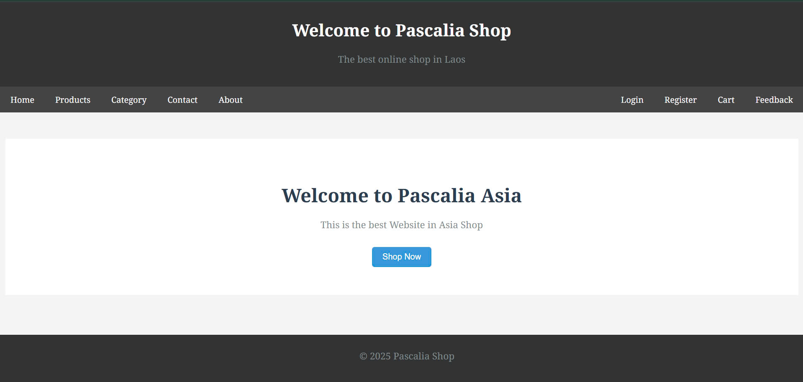
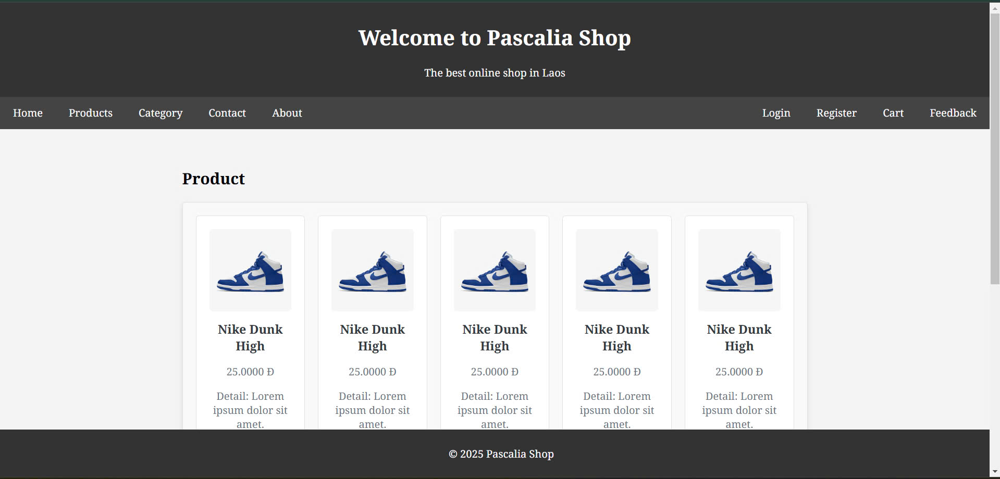
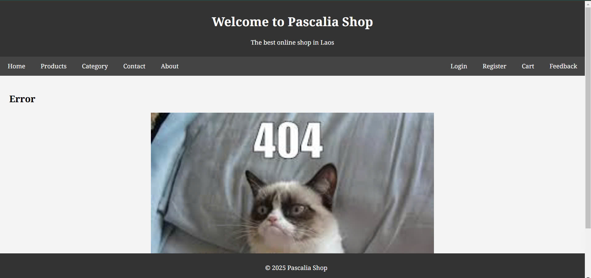
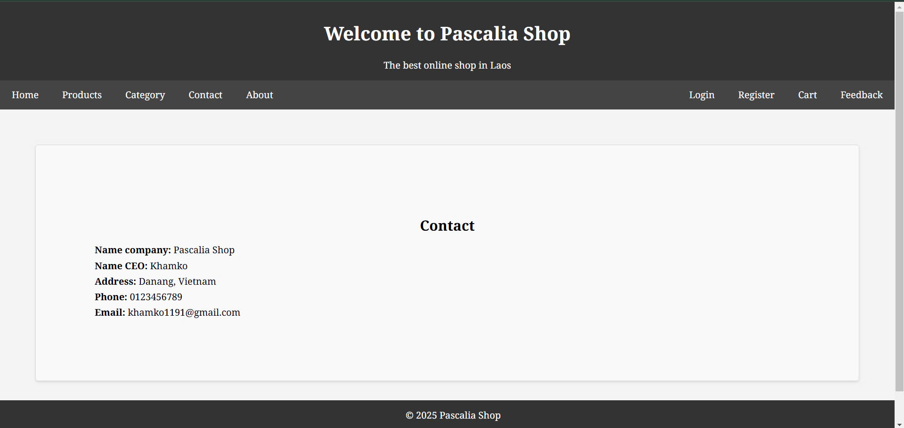
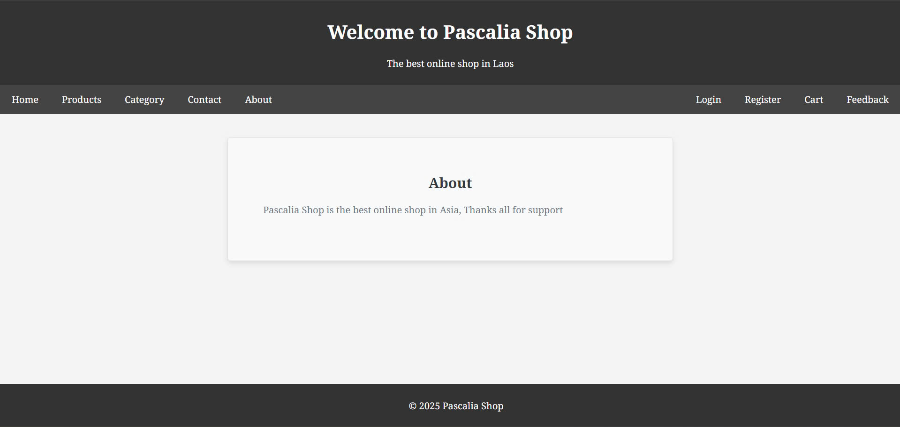
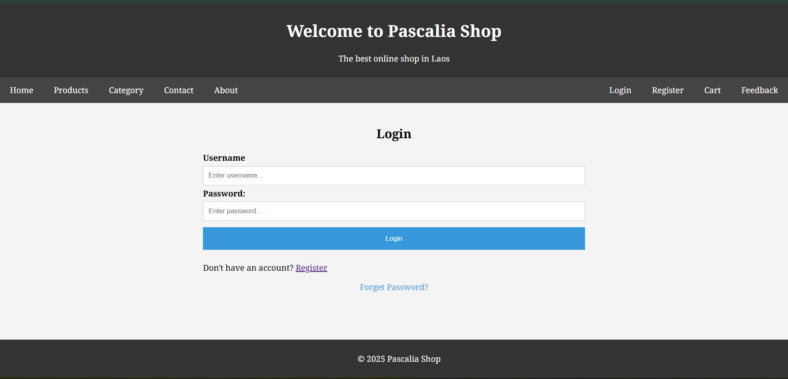
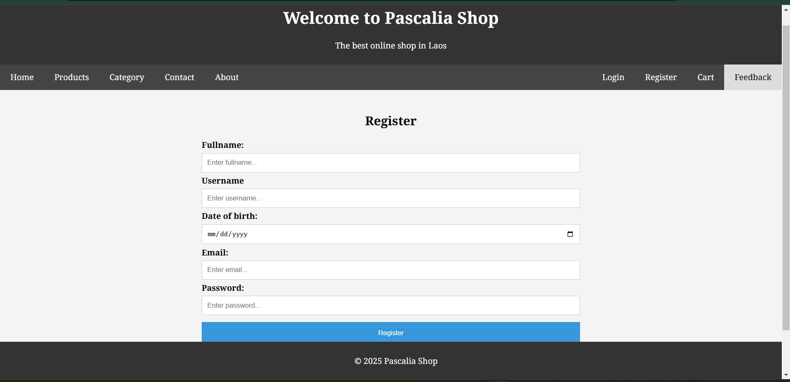
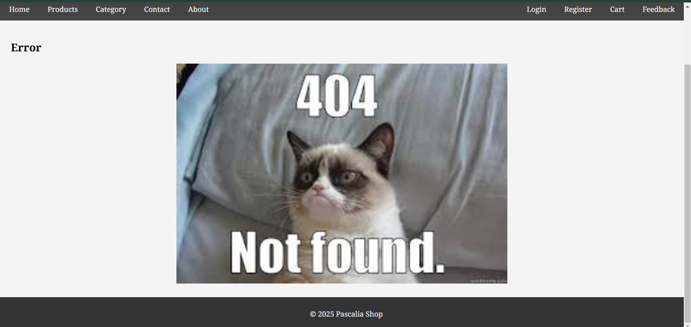
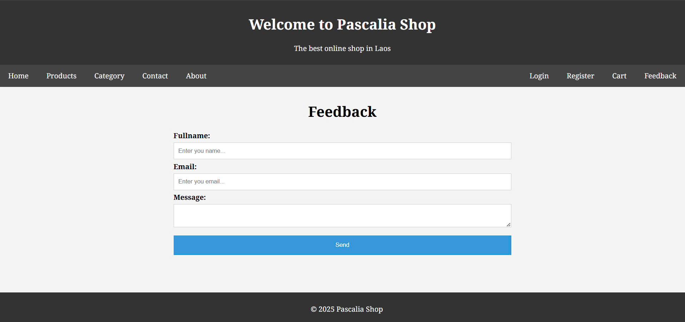

# Pascalia Shop

A Laravel-based e-commerce website that provides online shopping functionality. ( This file Readme.md i am use AI for code Readme )

## Features

- User authentication (Login/Register)
- Product catalog browsing
- Shopping cart functionality
- Contact page
- Feedback system
- Responsive design

## Tech Stack

- Laravel 9.x
- MySQL
- Bootstrap CSS
- Blade templating
- PHP 8.0.2+

## Installation

1. Clone the repository:
```sh
git clone https://github.com/khamko07/e-commerce_Laravel.git
cd e-commerce_Laravel 
```

2. Install PHP dependencies:
```sh
composer install
```

3. Create environment file:
```sh
cp .env.example .env
```

4. Generate application key:
```sh
php artisan key:generate
```

5. Configure your database in 

.env

 file:
```
DB_CONNECTION=mysql
DB_HOST=127.0.0.1
DB_PORT=3306
DB_DATABASE=testlaravel
DB_USERNAME=root
DB_PASSWORD=
```

6. Run database migrations:
```sh
php artisan migrate
```

7. Start the development server:
```sh
php artisan serve
```

## Project Structure

- app

 - Application core code
- views

 - Blade template files
- routes

 - Application routes
- public

 - Publicly accessible files
- migrations

 - Database migrations

## Contributing

1. Fork the repository
2. Create your feature branch (`git checkout -b feature/AmazingFeature`)
3. Commit your changes (`git commit -m 'Add some AmazingFeature'`)
4. Push to the branch (`git push origin feature/AmazingFeature`)
5. Open a Pull Request

## License

This project is licensed under the MIT License.

## Contact

Name: khamko
Email: khamko@pascaliaasia.com

## Screenshots

### Local Images











```


